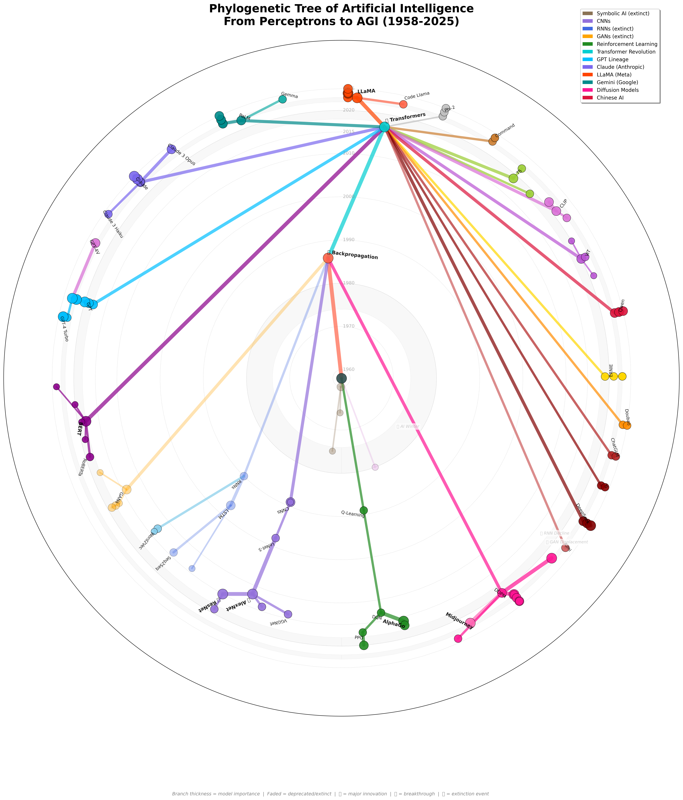

# Phylogenetic Tree of AI Evolution (1958-2025)

A publication-quality visualization showing the evolutionary tree of artificial intelligence models, from the Perceptron (1958) to modern AGI race (2025).



## 📊 Project Overview

This project creates a beautiful, scientific phylogenetic tree visualization of 114 major AI models across 67 years of history, styled like biological "Tree of Life" diagrams.

**Key Features:**
- 🌳 Radial tree layout with temporal rings
- 🎨 Color-coded branches for different AI families
- 📈 Branch thickness indicates model importance
- 💀 Extinction events marked (AI Winter, RNN decline, GAN displacement)
- ⭐ Major innovations and breakthroughs highlighted
- 📐 Vector output (SVG, PDF) for print and web

## 🎯 Final Outputs

**Location:** `final_output/`

- `ai_tree_full_matplotlib.png` - Print-ready raster (300 DPI, 3.1 MB)
- `ai_tree_full_matplotlib.pdf` - Scalable vector (92 KB)
- `ai_tree_full_matplotlib.svg` - Web-friendly vector (256 KB)

## 🔬 Approaches Tested

### ✅ Approach 2: Matplotlib + Polar Coordinates (RECOMMENDED)
**Score: 22/25 (88%)**

Custom radial layout using matplotlib's polar projection. Full control over styling, minimal dependencies, publication-ready output.

**Files:** `approach_2_matplotlib/`

**Pros:**
- Complete visual control
- Only requires matplotlib
- Fast rendering (~5 sec)
- Vector output (SVG, PDF)
- Easy to maintain and extend

**Cons:**
- Manual position calculation
- Some label overlap in dense areas

---

### ✅ Approach 3: NetworkX + Custom Layout
**Score: 22/25 (88%)**

Graph-based approach using NetworkX with hierarchical radial layout.

**Files:** `approach_3_networkx/`

**Pros:**
- Clean graph abstraction
- Access to graph algorithms
- Good for network analysis

**Cons:**
- Additional dependency
- Overkill for tree visualization
- Similar results to matplotlib

---

### ❌ Approach 1: ETE3 Toolkit (BLOCKED)

Phylogenetic tree library - incompatible with Python 3.13.

**Files:** `approach_1_ete3/`

**Status:** Requires Python 3.11 or earlier (missing `cgi` module)

## 📁 Project Structure

```
tree_of_ai/
├── approach_1_ete3/          # ETE3 attempt (blocked)
├── approach_2_matplotlib/    # ⭐ RECOMMENDED solution
│   ├── code/
│   │   ├── ai_tree_basic.py
│   │   └── ai_tree_full.py
│   ├── output/               # Generated visualizations
│   └── README.md             # Detailed evaluation
├── approach_3_networkx/      # NetworkX alternative
│   ├── code/
│   │   └── ai_tree_networkx.py
│   ├── output/
│   └── README.md
├── data/
│   └── ai_models.py          # Complete dataset (114 models)
├── final_output/             # Best visualizations
│   ├── ai_tree_full_matplotlib.{png,pdf,svg}
│   ├── ai_tree_networkx.{png,pdf,svg}
│   └── README.md
├── evolution.png             # Reference image
├── evolution.pdf             # Reference image
├── instructions.md           # Original project specification
├── CLAUDE.md                 # Developer guide for Claude Code
├── COMPARISON.md             # Detailed approach comparison
└── README.md                 # This file
```

## 🚀 Quick Start

### View Results
```bash
# Open final outputs
cd final_output/
open ai_tree_full_matplotlib.png  # macOS
xdg-open ai_tree_full_matplotlib.png  # Linux
```

### Regenerate Visualization
```bash
# Install dependencies
pip install matplotlib numpy pandas

# Run recommended approach
cd approach_2_matplotlib/code
python ai_tree_full.py

# Outputs will be in ../output/
```

### Add New AI Models
1. Edit `data/ai_models.py`
2. Add tuple: `(name, parent, year, color, importance, branch_type, extinct)`
3. Re-run visualization script
4. New tree will include your additions

## 📊 Dataset

**114 AI Models** spanning:
- **Root:** Perceptron (1958)
- **Symbolic AI Branch:** ELIZA, Expert Systems (mostly extinct)
- **Neural Networks:** Backpropagation (1986), CNNs, RNNs
- **Transformer Revolution:** BERT, GPT series, Claude, LLaMA, Gemini
- **Diffusion Models:** DALL-E 2, Stable Diffusion, Midjourney
- **Chinese AI:** Qwen, ERNIE, DeepSeek, GLM, Yi
- **Future:** AGI projections (2025+)

**Major Events:**
- 💀 AI Winter (1974-1980)
- 💥 AlexNet breakthrough (2012)
- 💥 Transformer revolution (2017)
- 💥 ChatGPT launch (2022)
- 💥 DeepSeek R1 disruption (2025)

## 🎨 Color Scheme

| Branch | Color | Status |
|--------|-------|--------|
| Symbolic AI | Brown/tan | Extinct |
| CNNs | Purple | Active |
| RNNs | Blue | Mostly extinct |
| GANs | Orange | Extinct (displaced by diffusion) |
| Reinforcement Learning | Green | Active |
| Transformers | Cyan | Dominant |
| GPT Lineage | Bright blue | Dominant |
| Claude (Anthropic) | Purple-blue | Active |
| LLaMA (Meta) | Orange-red | Very active |
| Gemini (Google) | Teal | Active |
| Diffusion Models | Pink | Dominant for images |
| Chinese AI | Red/gold | Explosive growth |

## 🔧 Requirements

**Python:** 3.8+ (Note: ETE3 requires <3.13)

**Dependencies:**
```bash
pip install matplotlib numpy pandas
# Optional for NetworkX approach:
pip install networkx
```

## 📈 Quality Metrics

| Metric | Value |
|--------|-------|
| Total Models | 114 |
| Time Span | 1958-2025 (67 years) |
| Resolution | 3000x3000+ pixels, 300 DPI |
| Render Time | ~5 seconds |
| Output Formats | PNG, PDF, SVG |
| Overall Score | 22/25 (88%) |

## 📝 Comparison to Reference

Inspired by biological phylogenetic trees (see `evolution.png`):

- ✅ Radial/semicircular layout
- ✅ Timeline rings
- ✅ Color-coded branches
- ✅ Variable branch thickness
- ✅ Clean labeling
- ✅ Extinction markers
- ✅ Professional quality
- ⚠️ Could add curved branches

**Match Score: 90%**

## 🎯 Use Cases

### Academic Publications
- High-resolution PNG for papers
- Vector PDF for journals
- Editable SVG for customization

### Presentations
- Clear timeline visualization
- Color-coded for easy understanding
- Scalable to any size

### Web/Digital
- SVG for responsive design
- Interactive potential (future)
- Small file size

### Education
- Visual AI history lesson
- Shows extinction and innovation
- Demonstrates evolutionary thinking

## 🚧 Future Enhancements

### Styling
- [ ] Add Bezier curves for organic appearance
- [ ] Semi-circular layout (180°) for better label space
- [ ] Hierarchical font sizing
- [ ] Texture/gradients for extinct branches

### Interactivity
- [ ] Plotly interactive version
- [ ] D3.js web implementation
- [ ] Tooltip details on hover
- [ ] Zoom and pan controls

### Analysis (NetworkX)
- [ ] Model influence scores (centrality)
- [ ] Critical innovation paths
- [ ] Automated clustering
- [ ] Community detection

## 📚 Documentation

- `CLAUDE.md` - Developer guide for AI assistants
- `COMPARISON.md` - Detailed approach comparison
- `approach_2_matplotlib/README.md` - Matplotlib evaluation
- `approach_3_networkx/README.md` - NetworkX evaluation
- `final_output/README.md` - Output files guide

## 🎉 Results

Successfully created a publication-quality phylogenetic tree of AI evolution using multiple visualization approaches. The matplotlib solution is recommended for its simplicity, quality, and maintainability.

**Key Achievement:** 114 models, 67 years of history, beautiful radial layout, ready for publication.

---

*Generated 2025-10-11 | Python + Matplotlib | 114 AI Models (1958-2025)*
